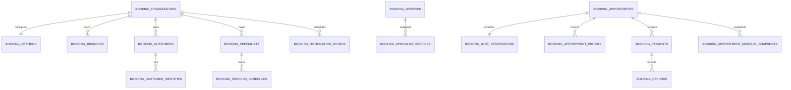
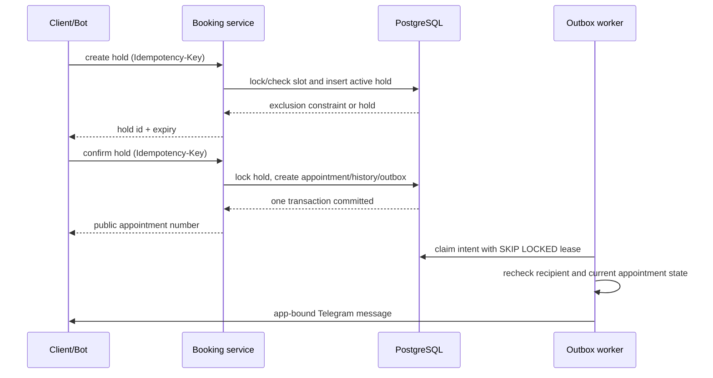

# Модуль booking

`booking` — первый предметный модуль Spacewhy. Он ведёт запись на одну услугу к одному
специалисту в одном филиале через Telegram и будущие Mini App-клиенты. Модуль не создаёт
frontend или Telegram Mini App UI: HTTP/OpenAPI-контракт предназначен для отдельной команды
клиента.

## Границы v1

Одна запись содержит клиента, филиал, услугу, специалиста и один временной интервал. В v1
осознанно отсутствуют несколько услуг в записи, групповые занятия, помещения/оборудование,
абонементы, программы лояльности, recurring-записи, лист ожидания, онлайн-эквайринг,
фискализация и закупки/FIFO. Касса — это внутренний неизменяемый учёт смен, оплат, возвратов и
ручных операций.

## Архитектура и изоляция данных

Все предметные таблицы имеют `organization_id`. Контекст организации приходит только от
проверенной booking-сессии или серверной связи `booking_bot → BookingTelegramBotInstallation →
BookingOrganization`; клиент не передаёт `organization_id`. Каждый запрос, загрузка объекта и
внешний ключ проверяются в tenant scope, поэтому UUID другого tenant-а не открывает данные.

Слои модуля расположены в `src/app/modules/booking`:

- `domain` содержит value objects, slot engine и state machine без FastAPI/Telegram/ORM;
- `application` содержит команды, права, бизнес-транзакции, Telegram-flow и SQL-агрегированную
  аналитику;
- `infrastructure` содержит SQLAlchemy модели, signed sessions и worker;
- `presentation/http` и `presentation/telegram` остаются тонкими transport adapters;
- `bootstrap.py` собирает runtime и регистрирует только `booking_bot`.



## Время, слоты и конкуренция

Все моменты в БД — aware UTC `timestamptz`; локальный календарный день и расписание
рассчитываются по IANA timezone филиала (или timezone организации). Ночные смены не принимаются
неявно: их нужно разделить на два same-day интервала. Несуществующие wall-clock времена при DST
не превращаются молча в другой момент.

Slot engine объединяет weekly schedule и available overrides, вычитает unavailable exceptions,
учитывает длительность услуги, буферы, шаг слота, lead/horizon policy и активные busy intervals.
Вычисление availability — только подсказка: окончательная проверка повторяется в транзакции
создания hold.

PostgreSQL остаётся источником истины:

- `booking_reservations_no_active_overlap` — GiST exclusion constraint на tenant, specialist и
  half-open `tstzrange(busy_starts_at, busy_ends_at, '[)')`;
- active weekly schedule intervals тоже не могут пересекаться;
- hold, appointment, payment/refund и stock операции используют row/advisory locks и tenant
  idempotency records;
- уникальности material recipes/snapshots считают `NULL warehouse_id` равным `NULL`, чтобы нельзя
  было создать несколько глобальных строк рецепта.



Перенос не является статусом: старая reservation остаётся активной, пока новая hold не создана.
Commit переносит занятие атомарно — освобождает старую reservation, превращает новую в appointment
reservation, пишет history и заменяет future reminders. Если новый hold не проходит, старая запись
не меняется.

## Статусы и история

Допустимы только переходы `pending → confirmed/cancelled`, `confirmed →
checked_in/completed/cancelled/no_show`, `checked_in → completed/cancelled`. Terminal состояния не
откатываются. `auto_confirm_booking` задаёт начальный `confirmed` либо `pending` статус.

Appointment хранит snapshots названия услуги/специалиста, длительности, цены и валюты, поэтому
изменение каталога не переписывает историю. `AppointmentHistory` фиксирует создание,
подтверждение, перенос, отмену, completion, no-show и ручной price override. Исправления денег и
склада создаются reversal/adjustment-операциями, а не редактируют историю.

## Аутентификация, доступ и API

Telegram WebApp получает short-lived signed booking session только через официально подписанный
`initData`:

- `POST /api/v1/booking/auth/telegram/client`;
- `POST /api/v1/booking/auth/telegram/staff`.

Сырые Telegram ID, имя пользователя и организация из запроса не являются доказательством
личности. Staff-сессия дополнительно требует active staff binding и access grant. Любая команда,
которая меняет состояние, требует `Idempotency-Key`.

Основные группы OpenAPI:

- `/api/v1/booking/client/*`: bootstrap, branches/categories/services/specialists,
  availability, holds, appointments, cancel и двухшаговый reschedule;
- `/api/v1/booking/staff/me/*`: личная agenda, чтение своей записи и confirm/check-in/complete/
  no-show/cancel;
- `/api/v1/booking/admin/*`: policy settings, bind codes, каталог, записи, касса, склад и
  analytics;
- `/api/v1/booking/admin/resources/{resource}`: строго ограниченное управление только
  разрешёнными booking resource fields, а не generic CRUD.

Права проверяются как конкретные permissions, а не только роль. Specialist видит только свои
записи, если ему явно не дана broad permission. Клиент может отменять/переносить только свои
`pending`/`confirmed` записи до policy cutoff; staff/admin отмена требует непустую причину.

## Telegram и локализация

`booking_bot` имеет собственные webhook runtime, callback namespace `b:<nonce>:<index>`, durable
conversation state и catalogs в `locales/common` и `locales/bots/booking_bot` для `ru`, `uz`, `en`.
Callback хранит только короткий nonce/index; UUID и flow state остаются на сервере. Старый nonce
или callback другого пользователя не может изменить новую запись.

Клиентский flow: `/start`, безопасное создание Telegram identity, locale/contact при необходимости,
главное меню, выбор branch/category/service/specialist/date/slot, hold и confirm. «Мои записи»
показывает active appointments и пагинируемую историю. `/contacts` и `/help` получают текст через
module i18n. Контакт проверяется по `contact.user_id`, когда Telegram его присылает.

Staff сначала получает одноразовый TTL bind code от администратора и использует `/bind CODE`.
После этого доступны `/agenda`, `/agenda tomorrow`, собственные details и допустимые lifecycle
actions. Username никогда не используется как identity proof.

Webhook — `POST /webhooks/telegram/{bot_app_id}`. До парсинга update проверяется secret header
constant-time comparison. Update receipts и command idempotency защищают от повторной доставки.
Логи и метрики не включают token, webhook secret, chat ID, message text или PII.

## Уведомления, касса, склад, аналитика

Бизнес-транзакция пишет `NotificationOutbox` вместе с appointment event. Отдельный worker
`make worker-booking` использует `FOR UPDATE SKIP LOCKED`, lease recovery, bounded exponential
backoff и повторную проверку получателя/статуса непосредственно перед отправкой. Delivery имеет
гарантию **at-least-once**: после сбоя между отправкой и отметкой `sent` возможен повтор, но stale
reminder/cancel/reschedule не отправляется. Worker также очищает expired holds и создаёт
deduplicated daily staff agendas для каждого рабочего филиала; `daily_staff_agenda_time`
интерпретируется в IANA timezone конкретного филиала.

Cash shifts, payments, refunds и manual transactions записываются неизменно; cash payment может
требовать открытую смену. Completion берёт locks, проверяет stock policy, создаёт immutable stock
movement и меняет appointment status в одной транзакции. Dashboard `/admin/analytics` считает
агрегаты в PostgreSQL, принимает IANA timezone и возвращает bounded local-date daily series без
выгрузки сырых rows.

## Конфигурация и запуск

Шаблон `deployment/env/.env.example` содержит отключённый `BOOKING_BOT` и безопасные значения
`BOOKING_*`. Реальные token и webhook secret размещаются только в ignored environment/secret
manager. Порядок первого запуска:

```bash
cd backend
make migrate
make provision-booking ARGS='--organization-slug salon --organization-name "Salon" --owner-display-name "Owner"'
# Передайте выведенный одноразовый bind code владельцу; он отправит /bind CODE боту.
make run
make worker-booking
```

Provisioning command отказывается менять существующий tenant, создаёт organisation/settings,
app-to-tenant installation, initial owner specialist/grant и только hash одноразового bind code в
БД. Raw bind code печатается оператору один раз и не логируется. Bot можно provisionировать
отключённым, затем включить только после настройки реальных credentials и webhook.

Проверки из `backend`:

```bash
make lint
make typecheck
make test-unit
make test-architecture
make test-smoke
make test-integration  # требует TEST_DATABASE_URL с PostgreSQL
```

## Сознательные ограничения

Live PostgreSQL verification и migration application выполняются только в окружении с доступной
PostgreSQL 17. Не используйте SQLite как замену: GiST exclusion constraints, ranges и concurrent
locks являются частью гарантии модуля.
